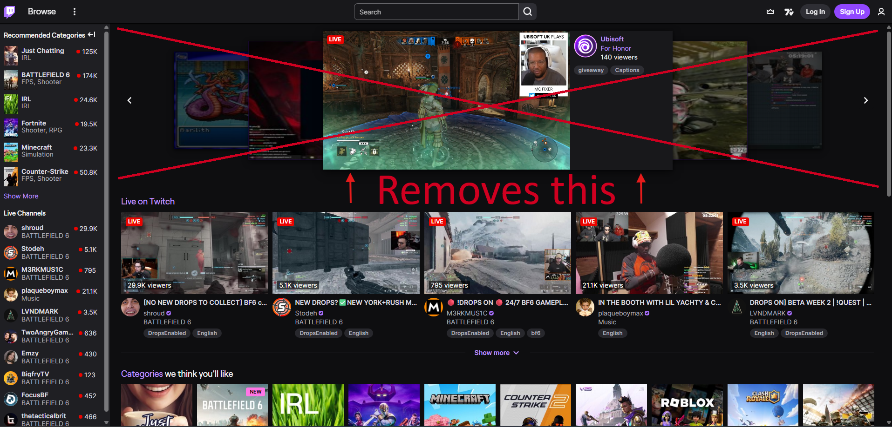

# Twitch Front Page Carousel Remover

##  Features

- **Lightweight**: Minimal impact on page performance
- **Instant**: Works immediately upon page load
- **Set & Forget**: No configuration needed

##  Installation

### Prerequisites
You'll need a userscript manager installed in your browser:

| Browser | Recommended Manager |
|---------|-------------------|
| Chrome/Edge | [Violentmonkey](https://chromewebstore.google.com/detail/violentmonkey/jinjaccalgkegednnccohejagnlnfdag) or [Tampermonkey](https://chromewebstore.google.com/detail/tampermonkey/dhdgffkkebhmkfjojejmpbldmpobfkfo) |
| Firefox | [Violentmonkey](https://addons.mozilla.org/en-CA/firefox/addon/violentmonkey/) or [Tampermonkey](https://addons.mozilla.org/en-US/firefox/addon/tampermonkey/) |
| Safari | [Userscripts](https://apps.apple.com/us/app/userscripts/id1463298887) |

### Install the Script

1. **[ Click here to install](https://raw.githubusercontent.com/LiquidJesus/twitch-carousel-remover/main/twitch-carousel-remover.user.js)**
2. Your userscript manager will open automatically
3. Click **"Install"** to confirm
4. Navigate to Twitch and enjoy!
