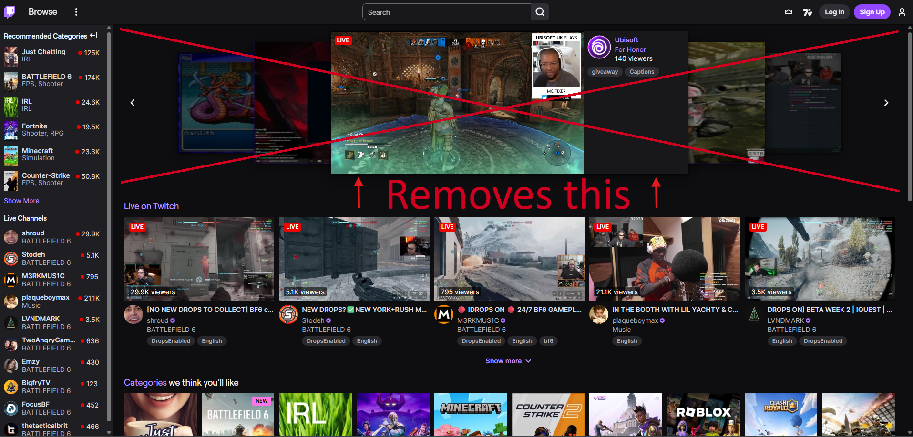

# Twitch Front Page Carousel Remover

### A lightweight userscript that removes Twitch's front page auto-playing streams.

##  Installation

1. **[ Click here to install](https://raw.githubusercontent.com/LiquidJesus/twitch-carousel-remover/main/twitch-carousel-remover.user.js)**
2. Your userscript manager will open automatically
3. Click **"Install"** to confirm
4. Navigate to Twitch and enjoy the silence and less clutter

## Requirements

> [!NOTE]
To install the userscript, you need one of the userscript managers listed below, or one that may not be listed.

| Browser | Recommended Manager |
|---------|-------------------|
| Chrome/Edge | [Violentmonkey](https://chromewebstore.google.com/detail/violentmonkey/jinjaccalgkegednnccohejagnlnfdag) or [Tampermonkey](https://chromewebstore.google.com/detail/tampermonkey/dhdgffkkebhmkfjojejmpbldmpobfkfo) |
| Firefox | [Violentmonkey](https://addons.mozilla.org/en-CA/firefox/addon/violentmonkey/) or [Tampermonkey](https://addons.mozilla.org/en-US/firefox/addon/tampermonkey/) |
| Safari | [Userscripts](https://apps.apple.com/us/app/userscripts/id1463298887) |
