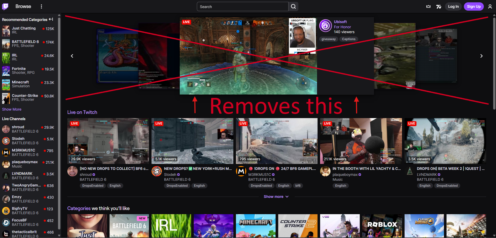

# Twitch Front Page Carousel Remover

### A lightweight userscript that removes Twitch's front page auto-playing streams.

##  Installation :

1. **[Click Here To Install](https://raw.githubusercontent.com/LiquidJesus/twitch-carousel-remover/main/twitch-carousel-remover.user.js)** - *Or click the .js file on the releases page*

2. Your userscript manager will open a new page asking to install.

3. Press **"Install"** to finish the installation.

##
###  *If you don't have a userscript manager, here are some recommended ones.*

| Browser | Recommended Manager |
|---------|-------------------|
| Chrome/Edge | [Violentmonkey](https://chromewebstore.google.com/detail/violentmonkey/jinjaccalgkegednnccohejagnlnfdag) or [Tampermonkey](https://chromewebstore.google.com/detail/tampermonkey/dhdgffkkebhmkfjojejmpbldmpobfkfo) |
| Firefox | [Violentmonkey](https://addons.mozilla.org/en-CA/firefox/addon/violentmonkey/) or [Tampermonkey](https://addons.mozilla.org/en-US/firefox/addon/tampermonkey/) |
| Safari | [Userscripts](https://apps.apple.com/us/app/userscripts/id1463298887) |
